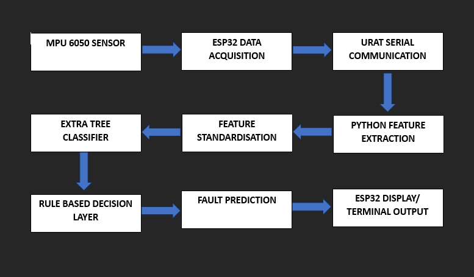
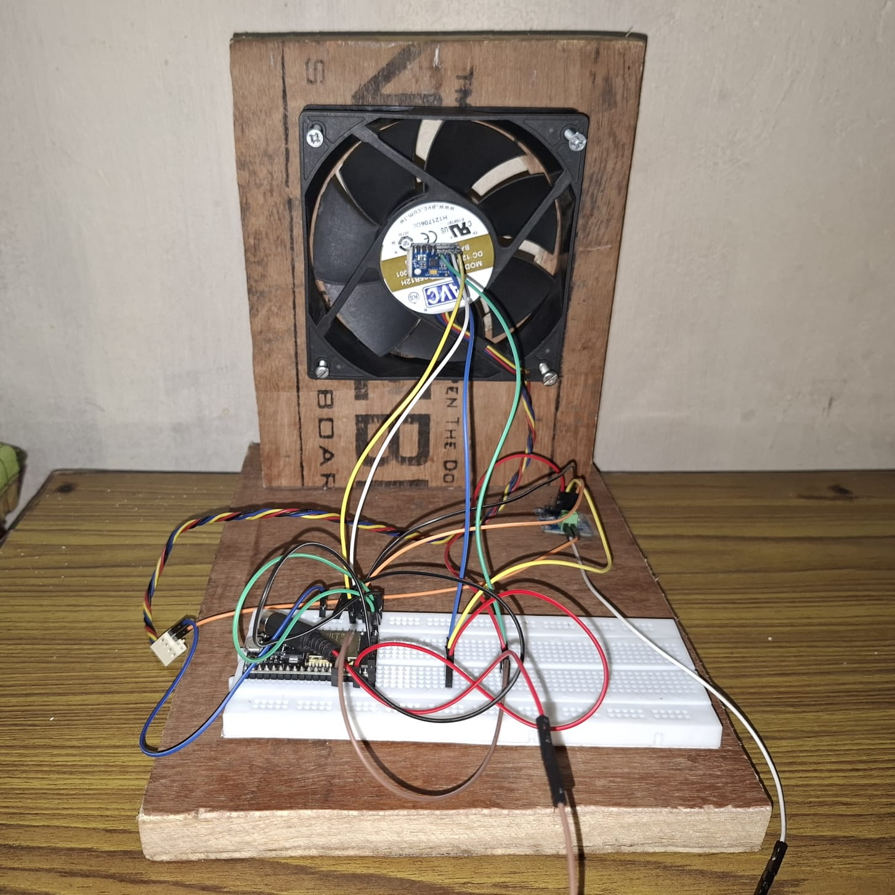
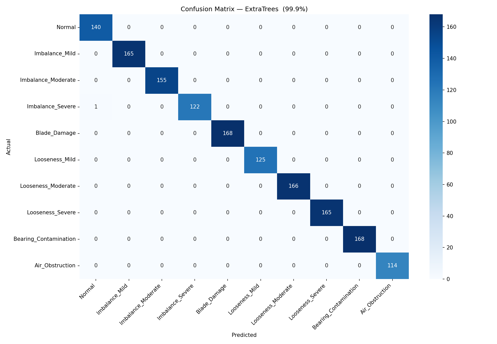
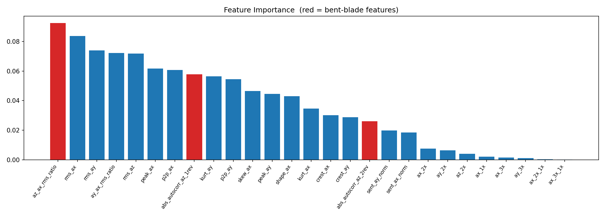
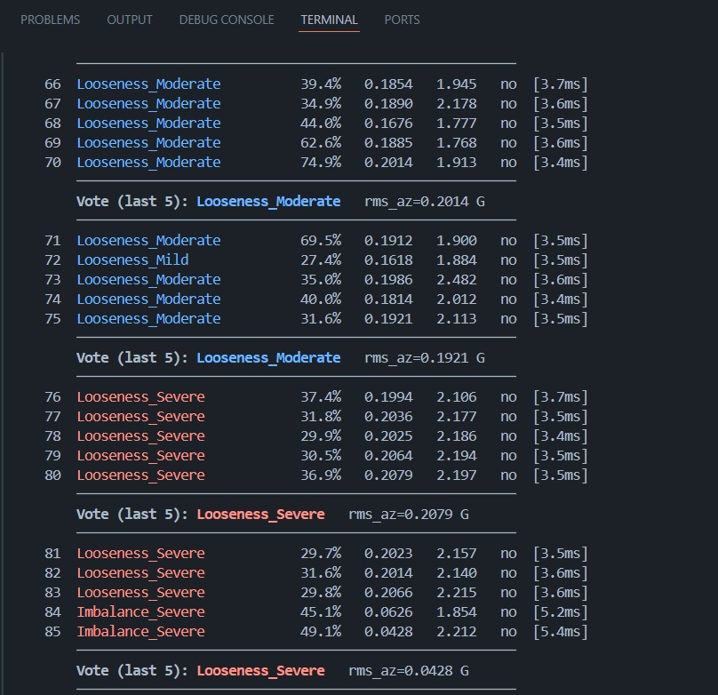

# AI-Based Predictive Maintenance System for Real-Time Fault Diagnosis of Rotating Machinery


## Overview

This project presents a low-cost AI-based predictive maintenance system for rotating machinery using vibration analysis, machine learning, and embedded sensing.

A custom test rig consisting of a 120 mm dual-ball-bearing DC fan, ESP32 microcontroller, and MPU6050 triaxial accelerometer was developed to collect vibration data under multiple fault conditions. The acquired signals are processed through a feature engineering pipeline and classified using machine learning models to identify machine faults in real time.

The system is capable of detecting:

* Normal Operation
* Mass Imbalance (Mild, Moderate, Severe)
* Mechanical Looseness (Mild, Moderate, Severe)
* Blade Damage
* Bearing Contamination
* Air Obstruction

---

## System Architecture



The complete pipeline consists of:

1. Vibration acquisition using MPU6050
2. Data transmission through ESP32
3. Feature extraction from vibration windows
4. Machine learning classification
5. Real-time fault prediction

---

## Hardware Setup

### Components

| Component     | Description                        |
| ------------- | ---------------------------------- |
| ESP32         | Data acquisition and communication |
| MPU6050       | Triaxial vibration sensor          |
| 120 mm DC Fan | Rotating machine under test        |
| PC            | Feature extraction and inference   |



---

## Dataset

The dataset consists of vibration recordings collected under ten operating conditions.

| Class | Description           |
| ----- | --------------------- |
| 0     | Normal                |
| 1     | Imbalance Mild        |
| 2     | Imbalance Moderate    |
| 3     | Imbalance Severe      |
| 5     | Blade Damage          |
| 7     | Looseness Mild        |
| 8     | Looseness Moderate    |
| 9     | Looseness Severe      |
| 11    | Bearing Contamination |
| 13    | Air Obstruction       |

Total dataset size:

* 7,443 vibration windows
* Window length: 1024 samples
* Sampling rate: approximately 595 Hz

---

## Feature Engineering

Twenty-seven vibration features were extracted:

### Time Domain Features

* RMS
* Peak
* Crest Factor
* Peak-to-Peak
* Kurtosis
* Skewness
* Shape Factor
* RMS Ratios
* Autocorrelation Features

### Frequency Domain Features

* 1× Harmonic Amplitude
* 2× Harmonic Amplitude
* 3× Harmonic Amplitude
* Harmonic Ratios
* Spectral Entropy

---

## Machine Learning Models

The following models were evaluated:

* Random Forest
* Extra Trees
* Deep Neural Network (DNN)

The Extra Trees classifier was selected for deployment due to its high accuracy and low computational complexity.

---

## Results

### Classification Performance

| Metric                    | Value  |
| ------------------------- | ------ |
| Cross Validation F1 Score | 99.96% |
| Test Accuracy             | 99.93% |
| Cross-Machine Accuracy    | 93.6%  |

### Confusion Matrix



### Feature Importance



---

## Real-Time Fault Detection

The trained model is integrated with a real-time Python inference framework.

Features:

* Live vibration acquisition
* Sliding-window analysis
* Majority-voting prediction
* Continuous fault monitoring



---

## Repository Structure

```text
firmware/
feature_engineering/
model_training/
realtime_inference/
models/
results/
images/
docs/
```

---

## Future Improvements

* True bearing fault dataset (BPFO/BPFI)
* Variable-speed operation
* TinyML deployment
* Multi-sensor fusion
* Cloud-based monitoring dashboard

---

## Author

Ankit Banerjee

B.Tech, Electronics and Communication Engineering

North-Eastern Hill University (NEHU)

Shillong, India

